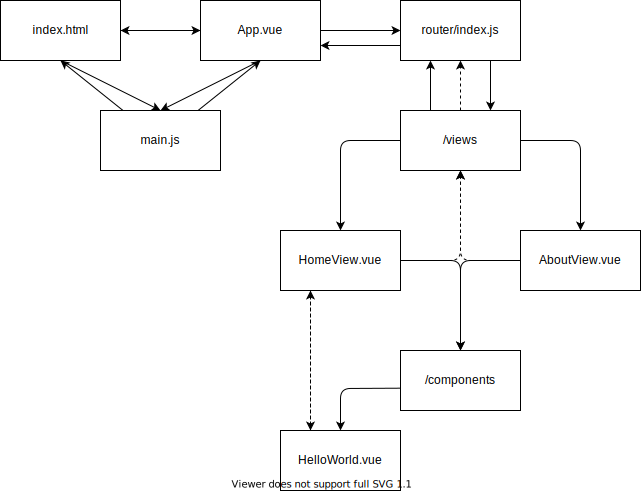
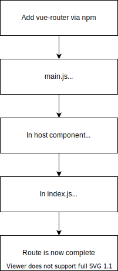

# Vue Cheatsheet

## If-Else-Show

```html
<p v-if="InStock">In Stock</p>
<p v-else>Out of Stock Stock</p>
<!-- <p v-else-if>Out of Stock Stock</p> -->

<p v-show="InStock">In Stock</p>
```

InStock pulls from exposed data() on main.js (global)

When to use v-if and v-show?

As a general rule for performance, v-if has higher toggle costs (whenever the conditional changes) and v-show has higher initial render costs. So if you need to toggle something frequently, use v-show

## v-for

```html
<ul>
  <li v-for="(detail, index) in details">{{ detail }}</li>
</ul>

<div v-for="variant in variants" :key="variant.id">{{ variant.color }}</div>
```

Including key is more performant, as is including index when no keys available. Note the :assignment, this is shorthand for attribute binding in Vue, aka v-bind

## Event Handling

```html
<button class="button" @click="addToCart">Add to Cart</button>
```

@assignment is shorthand for v-on, and can be used for any event assignment such as hover etc

## Class & Style Binding

```html
<div
  v-for="variant in variants"
  :key="variant.id"
  @mouseover="updateImage(variant.image)"
  class="color-circle"
  :style="{ backgroundColor: variant.color }"
>
  {{ variant.color }}
</div>
```

This in-line styling, but we could also expose a style object on data() and reference the styles in a cleaner manner:

```javascript
data() {
  return {
    styles: {
      color: 'red',
      fontSize: '14px',
    }
  }
}
```

```html
<div
  v-for="variant in variants"
  :key="variant.id"
  @mouseover="updateImage(variant.image)"
  class="color-circle"
  :style="styles"
>
  {{ variant.color }}
</div>
```

If passing a :bound style or class, ensure it is camelCase; if kebab-case, ensure it is wrapped in ''

### Multiple Class Binding

```javascript
data() {
  return {
    activeClass = true,
  }
}
```

```html
<div class="color-circle" :class="{ active: activeClass}"></div>
```

If activeClass evaluates to true, then the new div class becomes color-circle activeClass; they are essentially combined

```html
<div :class='[activeClass ? activeClass : '' ]'>
</div>
```

We can also make use of inline ternarys

## Computed Properties

```html
<h1>{{ title }}</h1>
```

```javascript
data() {
  return {
    product: 'Socks',
    brand: 'Vue Mastery',
  }
},
methods: {
  ...
},
computed: {
  title() {
    return this.brand + ' ' + this.product
  }
}
```

Computed properties cache the value, and as such boosts performance

## Components

Components enable reusale blocks and extract logic into managable chunks (MVC):

```javascript
app.component("product-display", {
  template:
    /*html*/
    `
  <div class='product-display'></div>
  `,
  data() {
    return {
      product: "socks",
      brand: "Vue",
    };
  },
  methods: {
    addToCart() {
      this.cart += 1;
    },
  },
  computed: {
    title() {
      return this.brand + " " + this.product;
    },
  },
});
```

Note the need for the single open and close code quotes, and the html comment to enable the rendering of the component. In index html we can then simply call the componenet with:

```html
<product-display></product-display>
```

## Props

But what if a component needs access to something outside of itself? Let's say the parent component had the message: Hello, but because each component has their own isolated scope, there's no way for the child component to access that message

This where we use props, which are custom attributes we use for passing data into a component. They function like a funnel, and channel data downwards:

```javascript
// main.js
const app = Vue.createApp({
  data() {
    return {
      cart: 0,
      premium: true,
    };
  },
  methods: {},
});
```

To access the premium prop, we need to pass it down and then call it on the component inside the html:

```javascript
// ProductDisplay.js
app.component('product-display', {
    props: {
        premium: {
            type: Boolean,
            required: true,
        }
    },
   template:
  /*html*/
  `
  <div class='product-display'></div>
  ...
  <p>Shipping: {{ shipping }}</p>
  `,
  data() {
    return {
      product: 'socks',
      brand: 'Vue',
    }
  },
  methods: {
    addToCart() {
      this.cart += 1
    }
  },
  computed: {
    title() {
      return this.brand + ' ' + this.product
    },
    shipping() {
      return this.premium ? 'Free' : '$4.99'
  }
```

```html
<product-display :premium="premium"></product-display>
```

We can also enforce type and if it is required in the props object. We also v-bind premium so that we can receive the new value of premium if it ever changes

# Understanding Vue Boilerplate

```
vue create platform-frontend-demo
Manually select features
> Router
> Vuex
> 3.x
> Y use history mode
> ESLint + Prettier
> Lint on save
> In package.json

cd platform-frontend-demo
npm run serve
```

src is the entire app code, everything that updates the DOM resides inside of here

Assets:
Images, fonts, etc

Components:
Building blocks of the app

Router: App navigation

Store: State management in a Vue app

Views: Components for different views/pages of the app, and act as parent containers for files in the components folder

App.vue is the root component, all other components are nested within this

Main.js renders the app and mounts it to the DOM

Note that in main.js we mount #app, which is the id reference to index.html, which in turn references App.vue

## App Structure





## Views Folder

When looking at a webapp built in Vue, we're really looking at a collection of Vue components, traditionally built with single file Vue components. These components typically have these sections:

- Template (the skeleton that gives the component structure, HTML)
- Script (the brain that gives the functionality and behavior, JS)
- Style (the clothes, makeup etc, CSS)

The views folder is where we store things like 'AboutView', and 'HomeView'. Within these components we nest other components. For example, HelloWorld.vue, in components, is nested within HomeView.vue. Within the template of HomeView we render HelloWorld, keeping the HomeView file managable, and extracting out the primary code into HelloWorld

In the HomeView component we are passing a msg down to HelloWorld, which is the being called with a h1 tag. Note the style scoped attribute in HelloWorld, this allows us to isolate styles to our given component
